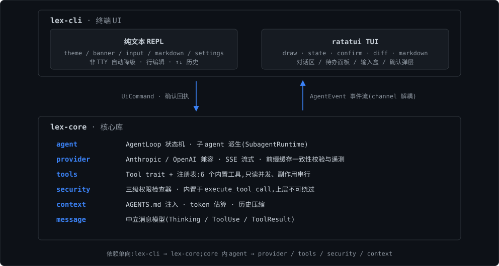

<div align="center">


# Lex Code

**类 Claude Code 的终端编程 Agent,用 Rust 从零实现。**

可插拔多 Provider(Anthropic 格式 + OpenAI 兼容格式)· DeepSeek 前缀缓存优化 · 三级权限沙盒


</div>

---

Lex Code 把"给一个任务、看着它自己干活"的 agent 体验完整搬进终端:单一 Agent Loop 驱动模型↔工具循环,全链路 SSE 流式渲染思考、正文与工具调用;只改配置就能在 Claude 端点与 DeepSeek 等 OpenAI 兼容端点之间切换,并针对 DeepSeek 做了**前缀缓存一致性校验与命中率遥测**。

## 功能特性

- **可插拔双格式 Provider** — `anthropic` 与 `openai`(OpenAI 兼容)两套 adapter,均 SSE 流式;同一把 DeepSeek Key 对两种端点通用。429/500/503 自动退避重试,重试字节级一致(payload 预序列化),错误信息带错误码语义提示(401 认证失败 / 402 余额不足 / 429 限速…)。
- **DeepSeek 前缀缓存优化** — 每轮请求对 system / tools / messages(逐条消息序列化)做字节级前缀比对,历史被改写等破坏缓存的情况记 warning 与遥测计数;命中率从响应 Usage 采集(`prompt_cache_hit_tokens` / `prompt_cache_miss_tokens`),终端每轮显示。实测命中率可达 97%。
- **三级权限沙盒** — Auto / Confirm / Forbidden 逐级放行;删 `.git`、force push、敏感文件外发等高危操作硬拦截,**用户配置不可静默移除**;权限检查器内置于工具执行路径,上层(含子 agent)不可绕过。
- **内置 6 个工具** — `file_read` / `file_edit`(保留原行尾,空 `old_string` 即新建文件)/ `bash_exec`(跨平台外壳)/ `grep_search`(内置 ignore+regex,不依赖外部 grep)/ `todo_write`(驱动待办面板)/ `spawn_subagent`(派生子 agent)。
- **子 agent 派生机制** — 子 agent 是独立上下文的完整 AgentLoop:权限继承父级、深度硬上限 2 层、每轮派生数量受配置预算约束,只把结构化摘要交回主对话。
- **AGENTS.md 项目指引** — 会话启动时自动注入项目根 `AGENTS.md`,一次组装进缓存前缀后逐字节不变。
- **上下文自动压缩** — 超过 `context.limit × 0.8` 触发一次历史摘要压缩(会话内仅一次,失败不消耗机会);也可用 `/compact` 手动触发,不受次数限制。
- **双形态终端界面** — 纯文本 REPL 与 ratatui 全屏 TUI(详见[界面预览](#界面预览));中文优先的交互文案,非 TTY 自动降级。

## 界面预览

以下为 TUI 界面原型图,以 SVG 内嵌 HTML 直接渲染(配色与文案对齐 `lex-cli/src/tui/` 实际渲染,输入光标在闪烁;交互源文件 [`docs/assets/tui-prototype.html`](docs/assets/tui-prototype.html))。

**主界面** — 盒式字符 banner、markdown 对话渲染、待办面板三态图标(◉ 完成 / ◐ 进行中 / ○ 待办)、斜杠命令补全、上下文容量行与缓存命中状态:


**权限确认弹层** — `file_edit` 展示带色 diff(增行绿 / 删行红),`bash_exec` 展示命令原文;禁止"是否继续?"式笼统确认:


**`/settings` 设置页** — 模型与 Provider / 权限与安全 / 上下文与压缩 / 外观·日志·关于 四大模块,字段编辑后写回 `lex-code.toml` 并热生效(provider 重建、安全规则与上下文限制即时切换):


## 架构



关键设计约束:

- `lex-cli → lex-core` 单向依赖;core 内 `agent → provider/tools/security/context` 单向。
- Thinking 块跨轮原样回传(Anthropic 空 signature 可接受,OpenAI 兼容端点 `reasoning_content` 缺失会 400)。
- 多轮历史的 tool_result 合入**单条 user 消息**,保持角色交替。
- HTTP 客户端只设 connect_timeout(30s),不设读取超时 —— SSE 长流不能被总超时截断。

## 构建

```bash
cargo build --release -p lex-cli   # 产物:target/release/lex-code(.exe)
cargo test --workspace             # 全量 249 个测试(含真实抓包/mock 回归)
```

运行时按以下顺序查找系统提示词文件 `assets/coding-agent-system-prompt.md`:配置 `system_prompt_path` → `<工作目录>/assets/` → `<可执行文件目录>/assets/`。对 release 二进制做冒烟时,需把该文件复制到 exe 旁。

## 快速开始

**1. 配置 API Key(只从环境变量读取,配置文件不放任何凭证)**

```bash
export LEX_ANTHROPIC_API_KEY=sk-...   # Anthropic 格式端点
# 或
export LEX_OPENAI_API_KEY=sk-...      # OpenAI 兼容端点(如 DeepSeek)
```

**2. 在项目根目录写一份 `lex-code.toml`**(最少只需 base_url + model)

```toml
# 方式一:Anthropic 格式端点
provider = "anthropic"
[anthropic]
base_url = "https://api.anthropic.com"
model = "claude-sonnet-4-5"
```

```toml
# 方式二:OpenAI 兼容端点(DeepSeek)
provider = "openai"
[openai]
base_url = "https://api.deepseek.com"
model = "deepseek-chat"
```

**3. 运行**

```bash
lex-code 修复 tests/foo.rs 里的失败用例   # 一次性任务,完成后退出
lex-code                                  # 交互模式(交互终端默认进入全屏 TUI)
lex-code --plain                          # 强制纯文本 REPL
lex-code -C D:/my/project 梳理项目结构     # 指定工作目录
```

## TUI 全屏界面

交互终端下默认启用 ratatui 全屏界面;`--plain` 强制纯文本流;stdin/stdout 任一非 TTY(管道/重定向)自动降级为行式输入。布局为左侧对话主区 + 右侧待办面板 + 底部输入盒 / 上下文容量行 / 状态行(左侧状态,右侧 token 用量与缓存命中)。

| 按键 | 作用 |
| --- | --- |
| `Enter` | 提交输入(空输入不提交) |
| `←` `→` `Home` `End` | 输入盒行编辑移动光标(CJK 按显示宽度计) |
| `/` | 触发斜杠命令补全(候选菜单:`↑/↓` 选择 · `Tab` 补全 · `Enter` 执行) |
| `PageUp` `PageDown` `鼠标滚轮` | 回看对话 / 弹层打开时滚动弹层内容 |
| `Ctrl+C` | 任务执行中:打断本轮(自动清理悬空历史,可直接继续);空闲时:退出 |
| `Ctrl+U` | 清空输入盒 |
| `y` / `n` / `Esc` | 确认弹层:允许 / 拒绝 |

纯文本 REPL:`↑↓` 翻输入历史、`Ctrl+C` 清空/打断/退出、`Ctrl+D` 退出;工具活动以 `● 工具(参数)` + `⎿ 结果首行` 呈现,子 agent 活动带 `⤷ [子N]` / `● [子N]` 归属前缀。

### 斜杠命令(REPL 与 TUI 同口径)

| 命令 | 作用 |
| --- | --- |
| `/settings` | 设置页:REPL 只读快照;TUI 可编辑并写回 `lex-code.toml` 热生效 |
| `/compact` | 手动触发历史压缩(与自动压缩共用摘要逻辑,不受阈值与次数限制) |
| `/init` | 驱动模型为当前项目生成 / 完善 `AGENTS.md` |

### 子 agent(`spawn_subagent`)

模型可把独立子任务派生给子 agent:子 agent 拥有独立历史与待办,权限规则表与确认处理器继承父级(**不构成权限旁路**),派生深度硬上限 2 层(主 0 → 子 1 → 孙 2),每轮派生数量受 `[agent] max_children_per_turn` 预算约束;只把最终结构化摘要交回主对话。

## 配置参考

优先级:**环境变量(`LEX_*`)> 项目级 `lex-code.toml`(工作目录)> 内置默认**。
`base_url` 与 `model` 必须显式提供,项目不内置任何默认 URL / 模型名。

| 字段 | 默认 | 说明 |
| --- | --- | --- |
| `provider` | `"anthropic"` | `"anthropic"` 或 `"openai"`(OpenAI 兼容端点) |
| `system_prompt_path` | 无 | 系统提示词文件路径;不填按上述顺序自动查找 |
| `max_turns` | `50` | 单轮任务内模型↔工具循环上限,超过报错终止 |
| `[anthropic].base_url` / `model` / `max_tokens` | 必填 / 必填 / `8192` | Anthropic 端点配置 |
| `[openai].base_url` / `model` | 必填 / 必填 | OpenAI 兼容端点配置 |
| `[openai].max_tokens` | 不发送 | 不设置走服务端默认(DeepSeek 非思考 8K / 思考 64K) |
| `[openai].thinking` | 不发送 | DeepSeek 思考模式:`"enabled"` / `"disabled"` |
| `[openai].reasoning_effort` | 不发送 | DeepSeek 思考强度:`"none"` / `"low"` / `"high"` / `"max"` |
| `[openai].user_id` | 不发送 | DeepSeek user_id(仅字母/数字/`-`/`_`,≤512 字符,勿含隐私) |
| `[shell].command` / `args` | 平台默认 | 覆盖 bash_exec 外壳。默认 Windows `cmd /C`,Unix `/bin/sh -c`;Windows 上可设 `command="bash", args=["-lc"]` 切 Git Bash |
| `[context].limit` | `64000` | 上下文 token 估算上限(本地按字符÷4 估算),超过 `limit × 0.8` 触发一次历史压缩 |
| `[context].enabled` | `true` | `false` 关闭上下文压缩 |
| `[agent].max_children_per_turn` | `4` | 每轮最多派生多少个子 agent;`0` 表示禁止派生 |
| `[security].forbidden` / `confirm` / `auto` | 内置默认 | 三级权限正则规则表(见下节),用户配置只能**追加** |

环境变量覆盖(优先于 TOML):`LEX_ANTHROPIC_BASE_URL`、`LEX_OPENAI_BASE_URL`。
API Key 环境变量:`LEX_ANTHROPIC_API_KEY` / `LEX_OPENAI_API_KEY`。

## 安全模型(三级权限)

每个有副作用的工具调用在执行前必经权限检查器,该路径不可被上层绕过;拦截/拒绝/失败都降级为错误 `ToolResult` 回填模型,不会中断会话。

- **Auto**:只读工具(`file_read` / `grep_search` / `todo_write`)直接放行
- **Confirm**:写文件、执行命令;需用户确认(弹层展示命令原文或 diff)
- **Forbidden**:硬拦截,不接受任何确认

内置 Forbidden 默认规则:删除 `.git` 目录、`git push --force` 变体、`rm -rf` 高危目标、敏感文件(`.env`、`*.pem`、`id_rsa*` 等)读取后同轮出现网络外发命令(启发式)。内置规则用户配置**不可静默移除**;`[security]` 三段正则只能追加:

```toml
[security]
forbidden = ["terraform\\s+destroy"]   # 追加 Forbidden 规则(正则)
confirm = ["git\\s+rebase"]
auto = ["cargo\\s+(fmt|clippy)"]       # 只读判定外,额外放行的命令模式
```

## 上下文管理与 DeepSeek 前缀缓存

- 会话启动时检测项目根 `AGENTS.md`,存在则注入 system prompt(一次组装,进入缓存前缀后逐字节不变)
- 上下文估算超过 `context.limit × 0.8` 时,对早期历史生成一次摘要压缩,**会话内只触发一次**(失败不消耗机会);`/compact` 手动触发不受限制;压缩摘要并入下一条用户消息,保持角色交替
- 压缩完成后向前缀缓存策略发"缓存链断开"信号,重置比对基线
- 前缀缓存校验:每轮请求将 system / tools / messages(逐条消息序列化)与基线做字节级前缀比对,历史被改写等破坏缓存的情况记 warning 与遥测计数,不阻断请求
- 缓存命中率从响应 Usage 采集(`prompt_cache_hit_tokens` / `prompt_cache_miss_tokens`,Anthropic 侧映射 `cache_read_input_tokens`),终端每轮显示,日志可查

## 日志与可观测性

日志全部写 stderr(TUI 全屏模式改写 `%TEMP%/lex-code-tui.log`,避免破坏 ratatui 画面)。级别选择:`LEX_LOG` > `RUST_LOG` > 默认 `warn`。

```bash
LEX_LOG=info lex-code ...    # 观察工具耗时、缓存命中率、压缩、重试等
LEX_LOG=debug lex-code ...   # 追加 agent 状态机转移
```

关键日志事件:

| 事件 | 级别 |
| --- | --- |
| 工具执行完成(名称/耗时/是否错误) | info |
| 工具执行失败,降级为错误 ToolResult | debug |
| Forbidden 规则硬性拦截 / 敏感文件读取后同轮外发被拦截 | warn |
| 服务端可重试错误自动退避(429/500/503) | warn |
| 前缀缓存一致性校验未通过(原因明细) | warn |
| 前缀缓存命中率(命中/未命中/命中率) | info |
| 历史压缩完成 / 压缩失败 / 缓存链断开 | info / warn / warn |

错误处理边界:网络失败、SSE 解析异常、文件 IO、命令执行失败等均以 `Result` 显式处理;provider 端 4xx/5xx 带错误码语义提示与自动退避重试;`lex-cli` 以完整错误链输出用户可读信息,不静默吞错。

## 测试与开发

```bash
cargo test --workspace        # 全部 249 个测试(含真实抓包/mock 回归)
cargo test -p lex-core        # 仅核心库
```

流式解析改动必须跑 `lex-core/tests/sse_replay.rs` 与 `lex-core/tests/openai_sse_mock.rs`(真实抓包回放,覆盖多种 chunk 切分)。TUI 的按键、布局、diff 着色由 ratatui `TestBackend` 单测覆盖。真实 API 冒烟步骤见 [`examples/smoke/README.md`](examples/smoke/README.md)。

目录结构:

```
lex-core/src/    核心库:message / provider / agent / tools / security / context / config / prompt
lex-cli/src/     终端 UI:main / confirm / ui(theme/banner/input/markdown/events/settings) / tui(...)
assets/          运行时系统提示词(外部资源,不硬编码进代码)
docs/assets/     界面原型图、架构图与源文件(tui-prototype.html + 动效 SVG)
examples/smoke/  真实 API 冒烟步骤与联调结论
```

## 当前状态与路线图

已完成:Phase 1 MVP 闭环(Anthropic 端点)→ Phase 2 Provider 泛化(DeepSeek 真实冒烟,缓存命中 97%)→ Phase 3 grep/todo、三级权限、只读并发 → Phase 4 AGENTS.md 注入、上下文压缩、前缀缓存遥测 → Phase 5 错误边界与可观测性 → Phase 6 子 agent 派生机制 + ratatui TUI → `/settings` 设置页全功能(REPL 只读 + TUI 编辑写回热生效)。

明确不做:GUI / IDE 插件、多用户协作 / 服务化、CI/CD 集成。

## 许可证

[MIT](LICENSE) © 2026 Ruyi
